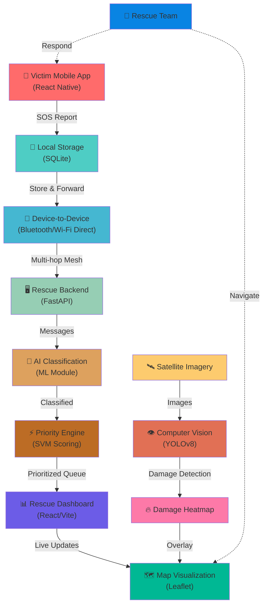

# System Architecture - Disaster Response System

## Overview

The Disaster Response System is designed as a modular, multi-tier architecture supporting emergency communication in disconnected environments. This document describes the high-level system architecture, component interactions, and data flow.

## Architecture Diagram



## System Components

### 1. Victim Mobile App (React Native)
- **Purpose**: Primary interface for disaster victims to report emergencies
- **Language**: JavaScript (React Native)
- **Key Features**:
  - Offline-first SOS form
  - GPS location capture
  - Photo/video documentation
  - Local message storage
  - Device-to-device communication
  - Automatic background sync

### 2. Local Storage (SQLite)
- **Purpose**: Persistent offline storage on mobile device
- **Technology**: SQLite
- **Stores**:
  - SOS messages (pending/sent)
  - Device contact list
  - Message history
  - Sync metadata

### 3. Device-to-Device Communication (Bluetooth/Wi-Fi Direct)
- **Purpose**: Relay messages between disconnected devices
- **Protocols**:
  - Bluetooth Low Energy (BLE) for battery efficiency
  - Wi-Fi Direct for higher throughput
- **Features**:
  - Automatic device discovery
  - Store-and-forward routing
  - Multi-hop message propagation
  - Duplicate message filtering
  - Message ACK/confirmation

### 4. Rescue Backend (FastAPI)
- **Purpose**: Central hub for message processing, storage, and coordination
- **Technology**: Python + FastAPI
- **Responsibilities**:
  - Receive SOS messages from devices
  - Store messages in database
  - Route messages to appropriate services
  - Provide REST API for dashboard
  - Coordinate with AI/ML services
  - Manage rescue team assignments

### 5. AI Classification Engine (ML Module)
- **Purpose**: Classify emergency types and extract key information
- **Technology**: scikit-learn (Python)
- **Models**:
  - TF-IDF text vectorizer
  - Support Vector Machine (SVM) classifier
- **Classification Types**:
  - Medical emergency
  - Structural collapse
  - Fire
  - Flooding
  - Missing persons
  - Other

### 6. Priority Scoring Engine
- **Purpose**: Rank emergencies by urgency and severity
- **Factors**:
  - Emergency classification type
  - Severity indicators (keywords like "trapped", "bleeding")
  - Location density (clusters)
  - Time sensitivity
- **Output**: Priority score (0-100)

### 7. Rescue Dashboard (React + Vite)
- **Purpose**: Real-time emergency coordination interface for rescue teams
- **Language**: JavaScript (React)
- **Key Features**:
  - Interactive map with victim locations
  - Priority queue of SOS requests
  - Team assignment management
  - Damage visualization (computer vision output)
  - Analytics and statistics
  - WebSocket for real-time updates

### 8. Map Visualization (Leaflet + OpenStreetMap)
- **Purpose**: Geographic display of emergencies and damage
- **Features**:
  - Offline map tiles
  - Victim location markers
  - Damage heatmap overlay
  - Route planning
  - Team position tracking

### 9. Computer Vision System (YOLOv8)
- **Purpose**: Detect and classify building damage from aerial imagery
- **Technology**: PyTorch + YOLOv8
- **Functions**:
  - Building detection
  - Damage classification (5-level scale)
  - Damage severity heatmap
  - Change detection (before/after)

### 10. Database (SQLite → PostgreSQL)
- **Purpose**: Persistent storage of all system data
- **Phase 1-2**: SQLite for development
- **Phase 8+**: PostgreSQL for production
- **Stores**:
  - Emergencies and SOS messages
  - User and team information
  - Message history
  - Damage reports
  - Analytics data

## Data Flow Scenarios

### Scenario 1: Offline SOS Submission (Phase 3)

```
1. Victim fills SOS form on mobile app
2. App captures GPS location and photos
3. Message stored locally in SQLite
4. When connectivity available:
   - Mobile connects to nearby device or backend
   - Message transmitted to backend
   - Backend acknowledges receipt
   - App marks message as delivered
5. Backend classifies message (Phase 5)
6. Priority score assigned (Phase 5)
7. Rescue team notified (Phase 7)
```

### Scenario 2: Device-to-Device Relay (Phase 4)

```
1. Device A (Victim 1) creates SOS message
2. Stored locally, cannot reach backend
3. Device B (Victim 2) nearby, connected to backend
4. Device A discovers Device B via Bluetooth
5. Device A forwards message to Device B
6. Device B receives message
7. Device B synchronizes with backend
8. Message reaches backend via multi-hop path
9. Duplicate detection prevents re-processing
```

### Scenario 3: Real-Time Dashboard Update (Phase 7)

```
1. Backend receives SOS message from mobile
2. Classifies message using ML model
3. Calculates priority score
4. Stores in database
5. Publishes WebSocket event to dashboard
6. Dashboard receives update
7. New marker appears on map
8. Queue updates with new priority
9. Rescue team sees updated information
10. Team navigates to location
```

### Scenario 4: Damage Assessment (Phase 6)

```
1. Satellite imagery received post-disaster
2. Backend calls CV module with image
3. YOLOv8 detects buildings
4. Damage classifier scores each building
5. Heatmap generated
6. Results published to dashboard
7. Rescue team sees damage concentration
8. Prioritizes high-damage areas
9. Allocates resources accordingly
```

## Technology Stack Summary

| Component | Technology | Language | Purpose |
|-----------|-----------|----------|---------|
| Mobile | Expo + React Native | JavaScript | SOS collection & offline comms |
| Dashboard | React + Vite | JavaScript | Rescue coordination UI |
| Backend | FastAPI | Python | API & message processing |
| Database | SQLite → PostgreSQL | SQL | Data persistence |
| ML | scikit-learn | Python | Emergency classification |
| CV | PyTorch + YOLOv8 | Python | Damage detection |
| Maps | Leaflet + OSM | JavaScript | Geospatial visualization |
| Messaging | Bluetooth/Wi-Fi Direct | Mobile SDKs | Device-to-device comms |

## Module Dependencies

```
mobile/
├── depends on: communication, storage
└── communicates with: backend

dashboard/
├── depends on: backend API
└── displays: map, queue, analytics

backend/
├── depends on: database, ml, cv
└── provides API to: dashboard, mobile

ml/
├── depends on: training data
└── consumed by: backend

cv/
├── depends on: satellite imagery, trained models
└── consumed by: backend, dashboard

communication/
├── depends on: mobile app
└── enables: device-to-device messaging

database/
└── consumed by: backend, ml, cv
```

## Data Models

### Emergency (Phase 2)
```python
{
    "id": "sos_12345",
    "timestamp": 1693468200,
    "victim_id": "mobile_device_1",
    "latitude": 28.7041,
    "longitude": 77.1025,
    "description": "Building collapsed, people trapped",
    "emergency_type": "structural_collapse",
    "severity_score": 9.2,
    "priority_rank": 1,
    "status": "assigned"
}
```

### Message (Phase 2)
```python
{
    "id": "msg_67890",
    "emergency_id": "sos_12345",
    "source_device": "mobile_1",
    "text": "Building collapsed, people trapped",
    "media": ["photo_1.jpg", "video_1.mp4"],
    "classification": "structural_collapse",
    "confidence": 0.94,
    "created_at": 1693468200
}
```

### Damage Report (Phase 6)
```python
{
    "id": "dmg_11111",
    "image_url": "satellite_001.tif",
    "latitude": 28.7041,
    "longitude": 77.1025,
    "damage_class": 3,  # 0-4 scale
    "confidence": 0.87,
    "created_at": 1693468300
}
```

## API Interface

### Backend API (Phase 2+)

```
POST /api/sos                    # Submit emergency
GET  /api/sos/{id}              # Get emergency details
GET  /api/sos/active            # List active emergencies
POST /api/messages              # Store forwarded message
GET  /api/priority-queue        # Get prioritized list
POST /api/classify              # Classify message
GET  /api/damage/heatmap        # Get damage heatmap
GET  /api/teams                 # List rescue teams
POST /api/assign                # Assign team to emergency
```

## Security Architecture (Phase 8+)

- **Authentication**: JWT tokens for dashboard users
- **Authorization**: Role-based access control (victim, rescuer, coordinator)
- **Encryption**: HTTPS for API, encryption for sensitive fields
- **Message Authentication**: HMAC signatures for device-to-device messages

## Performance Considerations

- **Latency Target**: < 1 second for emergency reporting
- **Throughput**: > 1000 emergencies/hour
- **Database**: Indexed queries for location, priority, status
- **Backend**: Asynchronous processing with task queues
- **Mobile**: Minimal power consumption with background sync

## Scalability Strategy

### Phase 1-2: Single Server
- SQLite local database
- Single FastAPI instance
- Development setup

### Phase 8+: Distributed System
- PostgreSQL with replication
- Multiple backend instances (load balanced)
- Message queue (Celery + Redis)
- Microservices for ML/CV
- CDN for static content

## High Availability Plan

- Database backups (hourly → daily)
- Backend redundancy (active-active)
- Dashboard static files on CDN
- Graceful degradation in limited connectivity
- Offline-first mobile prevents data loss

## Future Enhancements

- WebRTC for peer-to-peer video communication
- Blockchain for message immutability
- Advanced ML for casualty estimation
- 3D building reconstruction from images
- Drone integration for imagery collection
- Mobile app push notifications
- SMS fallback for critical alerts

---

**Version**: 1.0  
**Phase**: 1 (Architecture Definition)  
**Last Updated**: August 2026  
**Status**: ✅ Ready for Phase 2 Implementation
